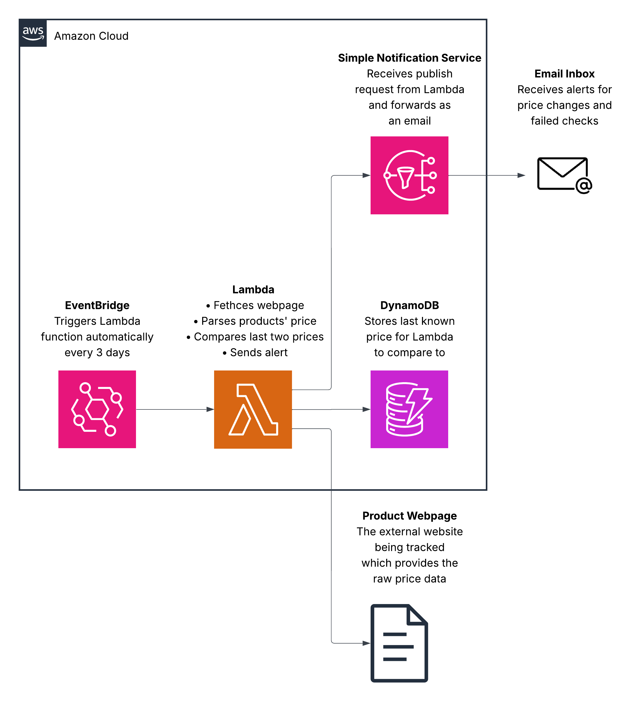

## AWS Price Tracker

A serverless price tracker built on AWS that checks a product page on a schedule and sends an email alert when the price changes by a certain amount. Used to deepen understanding of scheduled serverless workloads and the practical differences between AWS's overlapping scheduling services.

## Architecture

## AWS Services Used

- AWS Lambda – Fetches the product page, parses the price, compares it to the last known value, and triggers alerts 
- Amazon DynamoDB – Stores the last known price per product URL
- Amazon SNS – Publishes price alerts as email notifications
- Amazon EventBridge Scheduler – Triggers the Lambda function automatically every 3 days
- AWS IAM – Scoped, resource-specific permissions connecting Lambda to DynamoDB and SNS

## Request Flow
### Scheduled Price Check

1. EventBridge Scheduler invokes the Lambda function on a fixed interval
2. Lambda fetches the target product page with a browser-like User-Agent header
3. The price is parsed out of the returned HTML and cleaned into a plain number
4. Lambda reads the last known price for that URL from DynamoDB
5. If the price has changed by 10 percent or more in either direction, Lambda publishes an alert to SNS, which emails the subscriber
6. The current price is written back to DynamoDB, overwriting the previous value

### Failure Path

1. If the page fetch fails, or the price can't be found in the returned HTML, Lambda treats this as a broken tracker, not a missed check
2. An immediate alert is published to SNS notifying the subscriber that the tracker itself needs attention
3. No price is written to DynamoDB during a failed run, since there is nothing valid to store

## Design Decisions

- DynamoDB on-demand over provisioned – usage is low and infrequent (one check every few days for one product), so paying only for actual requests avoids reserving capacity that sits idle almost all the time
- Product URL as the DynamoDB partition key – uniquely identifies each tracked product, and allows the same table to scale to multiple products without any schema change
- 10 percent alert threshold – small fluctuations from rounding or coupon toggles are common and not meaningful; 10 percent sits at the lower edge of what typically represents a genuine sale
- Alert on failure, not just on price change – a tracker that silently breaks will show a price that never changes 
- EventBridge Scheduler over a cron job – the check runs independently of whether any personal device is powered on or connected to the internet

## Key Learnings

- EventBridge Scheduler and EventBridge Rules are separate products – Lambda's built-in "Add trigger" wizard only recognizes Rules, not Schedules, so a schedule created through Scheduler has to be granted invoke permission manually via a resource-based policy on the Lambda function itself
- IAM permissions are additive, not overriding – attaching a scoped policy alongside a broader existing policy does not restrict access; the broader policy remains in effect until it is explicitly removed
- Lambda's deployment package structure is strict – the handler file must sit at the top level of the zip, not nested inside a subfolder, or Lambda cannot locate it even if the code is correct
- DynamoDB requires Decimal, not float – Python floats are not natively supported as DynamoDB attribute values, so values must be converted to Decimal before writing and back to float after reading
- A code path can be broken and still pass early tests – an invalid placeholder value in the SNS publish call went unnoticed on the first successful test run, since a first run only stores a price and never reaches the alert path

## What I Would Do Next

- Adapt the scraper to a real Amazon product page, including handling bot detection and extracting a stable product identifier instead of trusting the full URL
- Multi-product support, using the existing URL-based partition key design to track several products from one deployment
- SMS alerts via SNS in addition to email, for faster notification on real price drops
- A CloudWatch alarm on repeated Lambda failures, rather than relying solely on the in-function failure alert
- Infrastructure as code (AWS SAM or CDK) to replace the manual console setup with a repeatable, version-controlled deployment
- A lightweight web dashboard for users to view tracked products and price history by removing the DynamoDB overwrite feature

## Contact

Open to internship and graduate opportunities in software engineering and cloud computing.

- Email: nevenspooner03@gmail.com
- LinkedIn: https://www.linkedin.com/in/neven-spooner/
